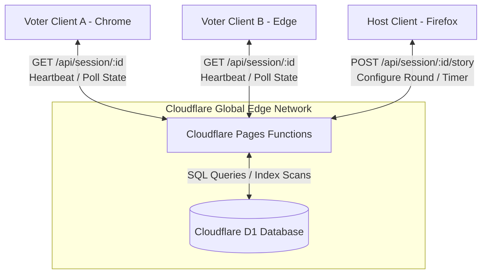
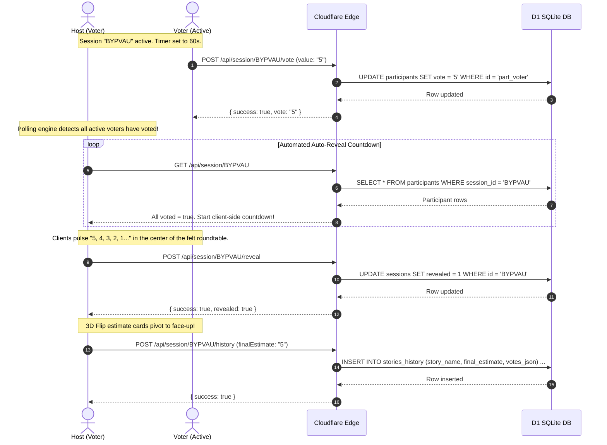
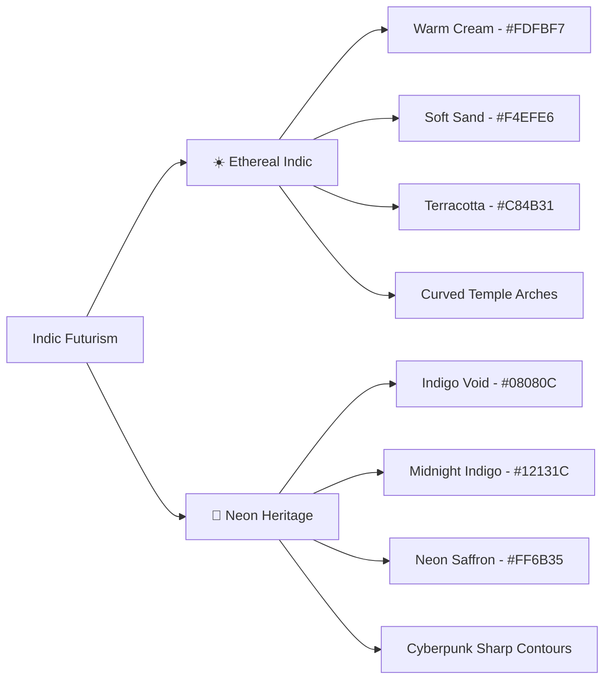

# 📐 Indic Futurism Planning Poker: Architectural & Design Guide

This guide details the system architecture, design decisions, and mathematical layouts governing the premium **Scrum Planning Poker** application.

---

## 🧭 System Architecture & Flow

The system is designed for the **Cloudflare Free Tier**, meaning it must run efficiently with zero server-side state (relying entirely on **Cloudflare D1 SQLite** for state persistence) and serve global clients at the Edge via **Cloudflare Pages Functions**.

### 🔗 Component Interaction Block



### 🔁 Sequence of a Voting Round

The diagram below details the sequence of a voting cycle from initialization, voting, automatic reveal countdown, to history archiving:



---

## 🎨 Design System: Indic Futurism

The design blends **heritage Indian motifs** with **sleek cyberpunk minimalism** across two adaptive, high-contrast visual modes.



### CSS Tokens & Style Application

*   **Custom Fonts:** Outfit (headings/accent numbers) and Inter (body content).
*   **Terracotta Accent Glows (Light Mode):**
    ```css
    box-shadow: 0 8px 30px rgba(200, 75, 49, 0.08);
    border-color: rgba(200, 75, 49, 0.2);
    ```
*   **Saffron Cyber Glows (Dark Mode):**
    ```css
    box-shadow: 0 0 15px rgba(255, 107, 53, 0.25);
    border-color: rgba(255, 107, 53, 0.4);
    ```
*   **Watermarks & Grids:** A repeating inline SVG background renders an elegant geometric diamond watermark in Light mode, turning into a cyber-saffron glowing grid pattern in Dark mode.

---

## 📐 Radial Roundtable Seating Mathematics

To replicate a physical Scrum poker table, participants are distributed mathematically around a central elliptical green felt canvas using custom polar coordinate formulas.

```text
               (Center Y - Radius Y)
                       |
(Center X - Radius X) -+- (Center X + Radius X)
                       |
               (Center Y + Radius Y)
```

### Mathematical Formulas

For a total count of $N$ participants, each participant $i$ (from $0$ to $N - 1$) is positioned at an angle:

$$\theta_i = \left(\frac{2\pi \cdot i}{N}\right) - \frac{\pi}{2}$$

The subtraction of $\frac{\pi}{2}$ rotates the coordinate system so the first participant is positioned directly at the **12 o'clock** position (top center), distributing clockwise thereafter.

The relative coordinate positions $(x_i, y_i)$ are mapped onto the elliptical felt canvas boundary as:

$$x_i = 50\% + R_x \cdot \cos(\theta_i)$$

$$y_i = 50\% + R_y \cdot \sin(\theta_i)$$

Where:
*   $R_x$ (Horizontal Radius) is set dynamically to **`38%`** (leaving padding for participant cards).
*   $R_y$ (Vertical Radius) is set dynamically to **`34%`** to match typical desktop viewport aspect ratios.

### Layout Implementation (JavaScript)
The calculation is updated inside the browser rendering pipeline:
```javascript
const angle = (2 * Math.PI * idx) / total - Math.PI / 2;
const rx = 38; // percentage of half-width
const ry = 34; // percentage of half-height
const x = 50 + rx * Math.cos(angle);
const y = 50 + ry * Math.sin(angle);

seatElement.style.left = `${x}%`;
seatElement.style.top = `${y}%`;
```

---

## 🛡️ Throttling & Connection Resiliency

Modern desktop browsers implement aggressive resource throttling on inactive tabs:
1.  **Request Throttling:** `setInterval` or `requestAnimationFrame` timers may drop down to once per second, or occasionally freeze entirely.
2.  **Edge Disconnections:** If a player is inactive, server-side cron triggers might sweep their session thinking they crashed.

To prevent this without complex WebSockets setups (which exceed standard Cloudflare free bandwidth caps), the system integrates a dual-layer resiliency strategy:

### 1. Extended Server Sweeps
The D1 backend utilizes a generous **90-second timeout** window. If a client tab is throttled or suspended temporarily, their slot remains reserved:
$$\Delta t_{\text{stale}} = t_{\text{current}} - t_{\text{last\_seen}} > 90\,\text{seconds}$$

### 2. High-Fidelity Client Focus Wakeup
A listener monitors browser tab visibility. The split-second a voter re-focuses or opens a background tab containing their active session, the engine triggers an instant, un-throttled HTTP poll, immediately refreshing status:
```javascript
document.addEventListener('visibilitychange', () => {
  if (document.visibilityState === 'visible') {
    // Force immediate REST API sync, bypassing standard interval timeouts
    syncStateImmediate();
  }
});
```

---

## ⚡ Cloudflare Free Tier Optimization Details

*   **D1 Storage Bounds:** D1 SQLite handles high-frequency index searches gracefully. To maintain low read/write units, active sweeps and heartbeats are compressed into a single query (`GET /api/session/[id]`).
*   **Payload Budgets:** Single Page App payload bundle size is kept under **100 KiB** by packing all styles (embedded Tailwind/vanilla definitions) and logic directly into a single cached `index.html` file, completely avoiding multi-megabyte frontend build runtimes.
